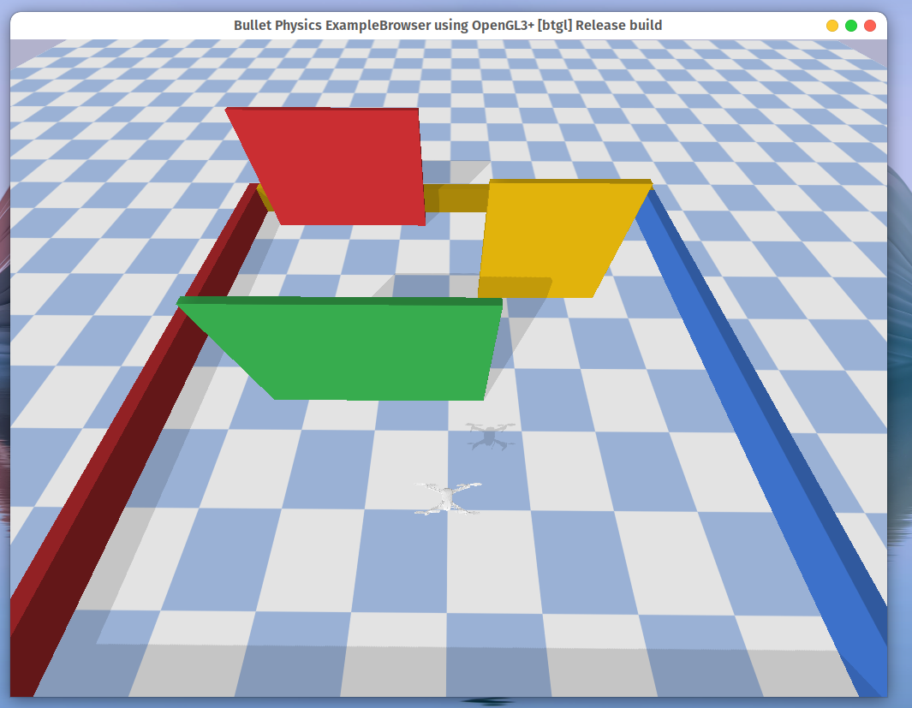

This is a demo repository for PDM 2022 course project.

# Installation

You need to install `poetry` for package management.

To be finished...


```shell
git clone <this-repository>

```

Install dependencies
```
poetry install --with "simulator, scenes, keyboard"
```

## Run a simple example
You can use following commands to start a simple demo:
```
python3 examples/drone_in_maze.py
```

You will see a drone in front of a maze. You can press alt and drag to change the view direction.




